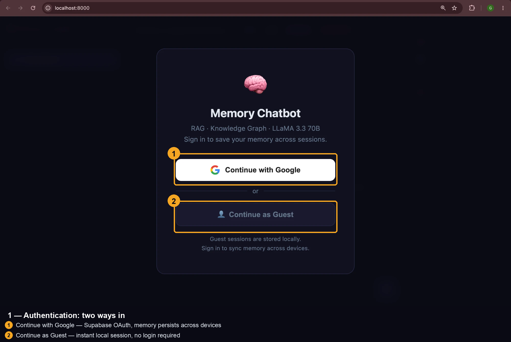
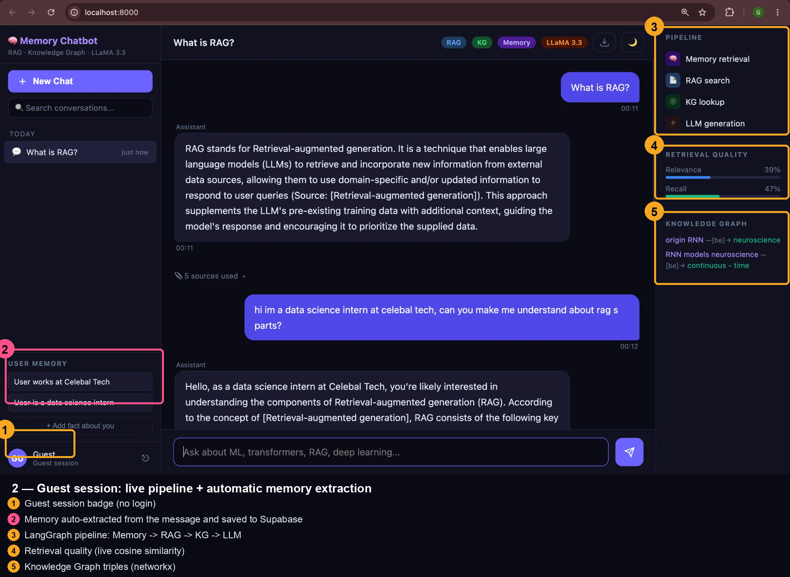
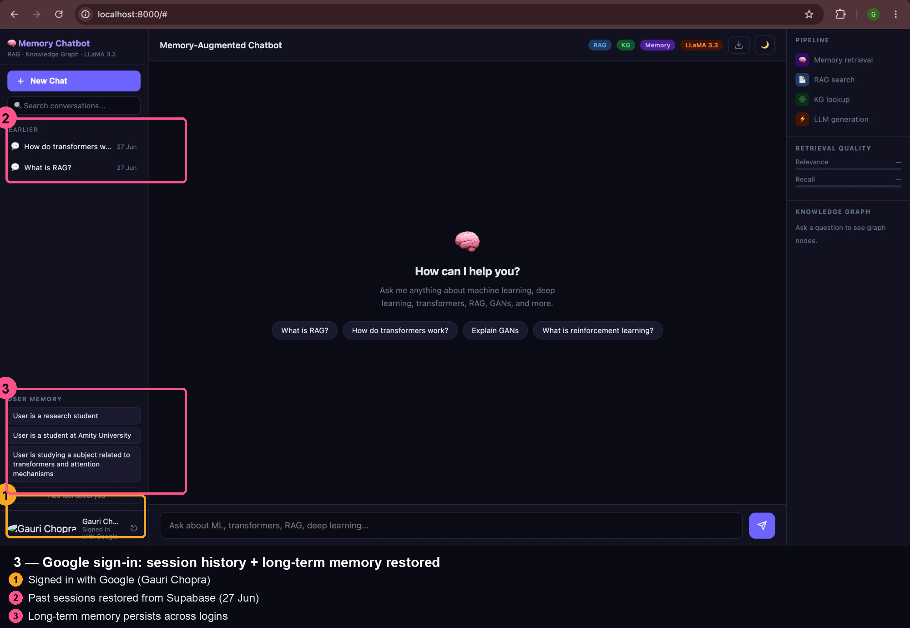
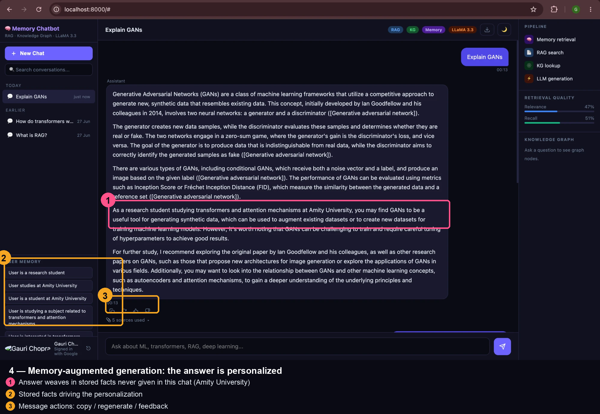
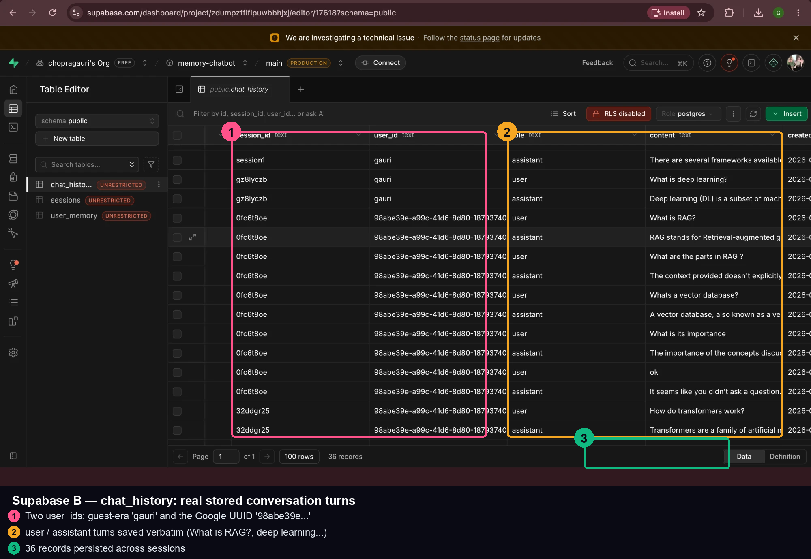
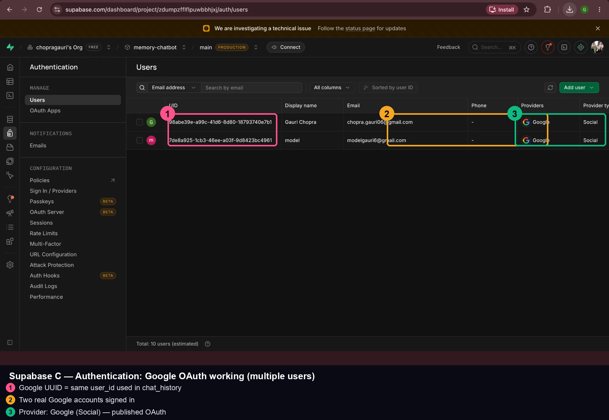

# Memory-Augmented Chatbot with Knowledge Graph and Hybrid RAG

A domain-specific AI assistant for **Machine Learning & AI** topics, built with a full hybrid RAG pipeline, LangGraph orchestration, Supabase-backed memory, and Google OAuth — developed as a Celebal Technologies internship project.

---

## Domain

**Machine Learning & Artificial Intelligence** — the knowledge base was built by scraping 15 Wikipedia articles:
Transformers, BERT, GPT-3, RAG, GANs, CNNs, RNNs, Word2Vec, Reinforcement Learning, Knowledge Graphs, Attention Mechanisms, Large Language Models, NLP, Deep Learning, Machine Learning.

---

## Architecture

```
User Query
    ↓
LangGraph StateGraph Orchestrator
    ├── memory_node  → Supabase (long-term user facts + preferences)
    ├── rag_node     → FAISS vector search (sentence-transformers, 163 chunks)
    ├── graph_node   → networkx Knowledge Graph (762 triples, offline)
    └── model_node   → Groq API — LLaMA 3.3 70B (cloud inference)
                    → Auto memory extraction (facts saved back to Supabase)
         ↓
    FastAPI /chat → index.html (3-panel UI)
```

---

## Tech Stack (Actual)

| Component | Tool | Notes |
|---|---|---|
| LLM | LLaMA 3.3 70B via **Groq API** | Cloud inference, free tier |
| Orchestration | **LangGraph** StateGraph | 4-node pipeline |
| Vector Search | **FAISS** + sentence-transformers | all-MiniLM-L6-v2, 384-dim, local |
| Knowledge Graph | **networkx** DiGraph | 762 triples, offline (no Neo4j) |
| Memory / History | **Supabase** PostgreSQL | user_memory + chat_history + sessions |
| Auth | **Supabase Auth** + Google OAuth | Guest mode also supported |
| Embeddings | sentence-transformers | all-MiniLM-L6-v2 |
| Data Pipeline | Wikipedia API scraper | 15 articles → 163 chunks |
| NLP / KG extraction | **spaCy** en_core_web_sm | dependency parsing, offline |
| Evaluation | Cosine similarity | context_relevance + context_recall |
| API | **FastAPI** | /chat, /sessions, /memory endpoints |
| UI | Vanilla HTML/CSS/JS | ChatGPT-style 3-panel layout |

---

## Data Pipeline

```
Wikipedia API scrape (15 articles)
    → clean & chunk (≤500 tokens)           163 chunks
    → embed (sentence-transformers)          384-dim vectors → FAISS index
    → NLP triple extraction (spaCy)          762 (subject, relation, object) triples
    → networkx KG                            1200 nodes, 760 edges
    → Supabase                               sessions, chat_history, user_memory tables
```

---

## Features

- **Hybrid RAG**: FAISS semantic search + Knowledge Graph triples combined in every prompt
- **Long-term memory**: User facts auto-extracted from conversation and persisted in Supabase
- **Session history**: ChatGPT-style sidebar — New Chat, session list, click to reload, delete
- **Google OAuth + Guest mode**: Sign in with Google for personal memory; guest mode for anonymous use
- **Pipeline visualization**: Real-time 4-step animation (Memory → RAG → KG → LLM)
- **Retrieval metrics**: Cosine-similarity-based Relevance and Recall shown per response
- **Domain-specific**: Trained knowledge base on ML/AI Wikipedia corpus

---

## Setup

> Requires **Python 3.10–3.12** (recommended). All commands are run from the project root.

### 1. Clone & create a virtual environment

**macOS / Linux**
```bash
git clone https://github.com/chopragauri/Memory-Augmented-Chatbot.git
cd Memory-Augmented-Chatbot
python3 -m venv venv
source venv/bin/activate
```

**Windows (PowerShell)**
```powershell
git clone https://github.com/chopragauri/Memory-Augmented-Chatbot.git
cd Memory-Augmented-Chatbot
py -m venv venv
venv\Scripts\Activate.ps1
```
> If PowerShell blocks the activate script, run once:
> `Set-ExecutionPolicy -Scope Process -ExecutionPolicy Bypass`
> (On classic Command Prompt use `venv\Scripts\activate.bat` instead.)

### 2. Install dependencies + spaCy model

**macOS / Linux**
```bash
pip install -r requirements.txt
python -m spacy download en_core_web_sm
```

**Windows (PowerShell)**
```powershell
pip install -r requirements.txt
python -m spacy download en_core_web_sm
```

### 3. Configure environment variables

Create a `.env` file in the project root (copy the template):

**macOS / Linux**
```bash
cp .env.example .env
```

**Windows (PowerShell)**
```powershell
Copy-Item .env.example .env
```

Then open `.env` and fill in your keys:
```
GROQ_API_KEY=your_groq_api_key
SUPABASE_URL=https://your-project.supabase.co
SUPABASE_KEY=your_supabase_anon_key
```
- **Groq key** (free): https://console.groq.com/keys
- **Supabase** URL + anon key: Supabase dashboard → Project Settings → API
- Create the three tables first (see [Supabase Tables Required](#supabase-tables-required) below).

### 4. Run the app

Same command on every OS (works because keys are loaded from `.env`):
```bash
python -m uvicorn api.main:app --reload --port 8000
```
Then open **http://localhost:8000** in your browser.

> Pre-built FAISS index and Knowledge Graph are included in `data/`, so the app runs immediately — no scraping needed.

### 5. (Optional) Re-build the data pipeline from scratch

Run each step as a module from the project root (works on all OSes):
```bash
python -m data_pipeline.scraper       # scrape 15 Wikipedia articles
python -m data_pipeline.cleaner       # clean + chunk into 163 segments
python -m data_pipeline.embedder      # embed + build FAISS index
python -m knowledge_graph.extractor   # spaCy triple extraction (762 triples)
python -m knowledge_graph.graph_store # build networkx graph
```

> **Windows note:** always use `python -m module.name` (not `python data_pipeline/scraper.py`) so imports resolve correctly.

---

## Supabase Tables Required

```sql
-- Sessions
create table sessions (
  id text primary key,
  user_id text not null,
  title text default 'New Chat',
  created_at timestamptz default now(),
  updated_at timestamptz default now()
);

-- Chat history
create table chat_history (
  id bigserial primary key,
  session_id text not null,
  user_id text,
  role text not null,
  content text not null,
  created_at timestamptz default now()
);

-- User memory
create table user_memory (
  user_id text primary key,
  facts jsonb default '[]',
  preferences jsonb default '[]',
  last_seen timestamptz
);
```

---

## Evaluation

Evaluation uses cosine similarity (no external API needed):
- **Context Relevance** — similarity between retrieved chunks and the query
- **Context Recall** — similarity between the answer and retrieved chunks

Run: `python3 -m evaluation.eval`

### Results (7 domain queries)

| Query | Relevance | Recall | Top Source |
|---|---|---|---|
| What is RAG? | 0.430 | 0.685 | Retrieval-augmented generation |
| How does transformer attention work? | 0.503 | 0.491 | Transformer (deep learning) |
| What is a knowledge graph? | 0.649 | 0.715 | Knowledge graph |
| What is Word2Vec? | 0.639 | 0.737 | Word2vec |
| What is reinforcement learning? | 0.581 | 0.696 | Reinforcement learning |
| What is deep learning? | 0.583 | 0.603 | Deep learning |
| What are GANs? | 0.486 | 0.544 | Generative adversarial network |
| **Average** | **0.553** | **0.639** | |

> Metrics computed using cosine similarity between sentence-transformer embeddings of query, retrieved chunks, and generated answer — no external evaluation API required.

---

## Problem Statement Compliance

| Requirement | Status |
|---|---|
| Memory-augmented chatbot | ✅ Supabase long-term memory + auto-extraction |
| Knowledge Graph | ✅ spaCy + networkx, 762 triples |
| Hybrid RAG | ✅ FAISS vector search + KG context combined |
| LangGraph agent | ✅ 4-node StateGraph |
| FastAPI backend | ✅ /chat, /sessions, /memory |
| Evaluation metrics | ✅ Cosine similarity relevance + recall |
| UI | ✅ 3-panel ChatGPT-style with pipeline visualization |
| Domain-specific KB | ✅ 15 ML/AI Wikipedia articles, web-scraped |

---

## Screenshots — Annotated Walkthrough

The four screenshots below trace the full **memory-augmented** flow:
*login → guest use with auto-memory → sign in and see history restored → answers personalized from that memory.*

### 1. Authentication — Google OAuth + Guest Mode


Two ways in:
- **Continue with Google** → Supabase OAuth, memory persists across devices.
- **Continue as Guest** → instant local session, no login required.

---

### 2. Guest Session — Live Pipeline + Automatic Memory Extraction


- **Bottom-left badge "GU · Guest session"** — this is the guest path in use.
- The user typed *"hi im a data science intern at celebal tech…"* and the **USER MEMORY** panel auto-filled with *"User works at Celebal Tech"* and *"User is a data science intern"* — facts are **automatically extracted after each turn** and saved to Supabase.
- **Right panel** shows the full pipeline in action:
  - **Pipeline** — the 4-node LangGraph flow (Memory → RAG → KG → LLM)
  - **Retrieval Quality** — live cosine-similarity Relevance/Recall
  - **Knowledge Graph** — networkx triples (`RNN —[be]→ neuroscience`)
  - **"5 sources used"** — FAISS vector retrieval

---

### 3. Google Sign-In — Persisted History & Long-Term Memory


- **Bottom-left "Gauri Chopra · Signed in with Google"** — OAuth path in use.
- **Left sidebar (EARLIER: "How do transformers…", "What is RAG?" — 27 Jun)** — past sessions **reloaded from Supabase**, proving persistence across days and devices.
- **USER MEMORY** is already populated (*research student, Amity University…*) from earlier sessions — **long-term memory survives logout/login**.

---

### 4. Memory-Augmented Generation — Personalized Answer


- The answer to *"Explain GANs"* weaves in stored facts it was **never told in this conversation**:
  > *"As a research student studying transformers and attention mechanisms at Amity University, you may find GANs…"*

  This is the core proof that **stored memory actually influences generation**.
- **Message actions** row (copy · regenerate · 👍 · 👎) and session grouping (Today / Earlier) are visible.

---

## Supabase — Data Persistence (Backend Proof)

These confirm the UI claims are backed by real database rows:

### user_memory table — auto-extracted facts per user

> Rows keyed by `user_id` (a `guest_…` id and the Google UUID), each holding `facts` / `preferences` JSON — backs the **USER MEMORY** chips.

### sessions table — session history

> `id`, `user_id`, `title`, `updated_at` — backs the **left-sidebar session list**.

### chat_history table — stored conversation turns

> `session_id`, `role`, `content` — backs the **chat bubbles** when a session is reloaded.

### Authentication → Users — Google OAuth working

> The Google account listed with provider `google` — proves end-to-end OAuth sign-in.
